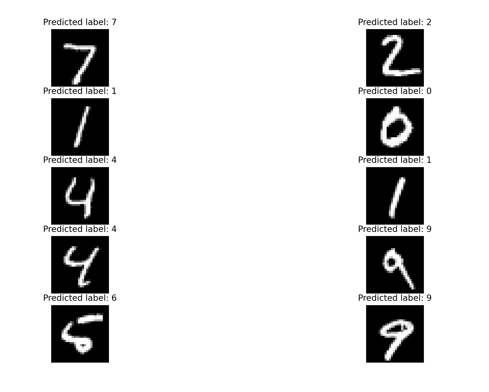

# Neural Network Exploration (MNIST)

This project explores the basics of neural networks using Keras and TensorFlow.  
A simple fully connected neural network is trained on the MNIST handwritten digits dataset to perform digit classification.

## Overview

- Loads and preprocesses the MNIST dataset
- Builds a feedforward neural network
- Trains the model using stochastic gradient descent
- Predicts and visualizes results on test images

  

## Model Architecture

- Input: 28 × 28 grayscale images (flattened)
- Hidden Layer 1: 300 neurons, ReLU activation
- Hidden Layer 2: 100 neurons, ReLU activation
- Output Layer: 10 neurons, Softmax activation

## Technologies Used

- Python
- TensorFlow / Keras
- NumPy
- Matplotlib
